# ReviewHome 데이터베이스 ERD 문서

## 📋 목차
1. [개요](#개요)
2. [테이블 구조](#테이블-구조)
3. [엔티티 관계도 (ERD)](#엔티티-관계도-erd)
4. [테이블 상세 설명](#테이블-상세-설명)
5. [관계 설명](#관계-설명)

---

## 개요

ReviewHome 프로젝트는 건물 및 동네 커뮤니티 기반 리뷰 플랫폼입니다. 
총 **24개의 테이블**로 구성되어 있으며, 사용자 인증, 지리 정보, 커뮤니티, 리뷰, 이미지, 배너, 상권 정보 등을 관리합니다.

### 데이터베이스 주요 도메인
- **인증 및 사용자 관리** (User)
- **지리 정보** (GeoFeatures, GeoLegalDong, GeoLocation)
- **건물 및 주소** (PostAddress, PostAddressInfo)
- **커뮤니티** (Community, CommunityEnterHistory, CommunityPost, CommunityPostReply, 등)
- **커뮤니티 관리** (CommunityAdmin, CommunityAdminRequest, CommunityNotice)
- **리뷰** (Review, ReviewLikeHistory, BuildingReviewContent)
- **배너** (Banner, BannerContent)
- **이미지** (Image)
- **상권 정보** (CommercialInfo)
- **업데이트 이력** (UpdateHistory)

---

## 테이블 구조

### 전체 테이블 목록 (24개)

| 번호 | 테이블명 | 설명 | 주요 관계 |
|-----|---------|------|----------|
| 1 | `user` | 사용자 정보 | 모든 created_by 필드의 참조 대상 |
| 2 | `geo_features` | 읍면동 지리 정보 (Geometry) | Community, PostAddressInfo |
| 3 | `geo_legal_dong` | 법정동 코드 정보 | - |
| 4 | `geo_location` | 건물 좌표 정보 | PostAddressInfo |
| 5 | `post_address` | 주소 검색 정보 | PostAddressInfo |
| 6 | `post_address_info` | 건물 상세 정보 | Review, CommercialInfo, GeoLocation |
| 7 | `community` | 커뮤니티 (건물/동네) | CommunityEnterHistory, CommunityPost |
| 8 | `community_enter_history` | 커뮤니티 가입 이력 | Community, User |
| 9 | `community_post` | 커뮤니티 게시글 | Community, CommunityPostReply |
| 10 | `community_post_reply` | 게시글 댓글 | CommunityPost, User |
| 11 | `community_post_like_history` | 게시글 좋아요 이력 | CommunityPost, User |
| 12 | `community_view_history` | 게시글 조회 이력 | CommunityPost |
| 13 | `community_admin` | 커뮤니티 관리자 | Community, User |
| 14 | `community_admin_request` | 관리자 신청 | Community, User |
| 15 | `community_notice` | 커뮤니티 공지사항 | Community, User |
| 16 | `review` | 리뷰 (건물/동네) | PostAddressInfo, User |
| 17 | `review_like_history` | 리뷰 좋아요 이력 | Review, User |
| 18 | `building_review_content` | 건물 리뷰 상세 내용 | Review |
| 19 | `banner` | 배너 | BannerContent |
| 20 | `banner_content` | 배너 컨텐츠 | Banner |
| 21 | `image` | 이미지 파일 정보 | User |
| 22 | `commercial_info` | 상권 정보 | PostAddressInfo |
| 23 | `update_history` | 업데이트 이력 관리 | - |
| 24 | `base_date_entity` | 공통 날짜 필드 (MappedSuperclass) | - |

---

## 엔티티 관계도 (ERD)

### ERD Mermaid 다이어그램

```mermaid
erDiagram
    USER ||--o{ COMMUNITY : creates
    USER ||--o{ COMMUNITY_ENTER_HISTORY : joins
    USER ||--o{ COMMUNITY_POST : creates
    USER ||--o{ COMMUNITY_POST_REPLY : writes
    USER ||--o{ COMMUNITY_POST_LIKE_HISTORY : likes
    USER ||--o{ REVIEW : writes
    USER ||--o{ REVIEW_LIKE_HISTORY : likes
    USER ||--o{ IMAGE : uploads
    USER ||--o{ COMMUNITY_ADMIN : "is admin"
    USER ||--o{ COMMUNITY_ADMIN_REQUEST : requests
    USER ||--o{ COMMUNITY_NOTICE : creates

    GEO_FEATURES ||--o{ COMMUNITY : "belongs to"
    GEO_FEATURES ||--o{ POST_ADDRESS_INFO : "belongs to"

    POST_ADDRESS ||--o{ POST_ADDRESS_INFO : "has details"
    POST_ADDRESS_INFO ||--o{ GEO_LOCATION : "has location"
    POST_ADDRESS_INFO ||--o{ REVIEW : "has reviews"
    POST_ADDRESS_INFO ||--o{ COMMERCIAL_INFO : "has commercial"

    COMMUNITY ||--o{ COMMUNITY_ENTER_HISTORY : "has members"
    COMMUNITY ||--o{ COMMUNITY_POST : "has posts"
    COMMUNITY ||--o{ COMMUNITY_ADMIN : "has admins"
    COMMUNITY ||--o{ COMMUNITY_ADMIN_REQUEST : "has requests"
    COMMUNITY ||--o{ COMMUNITY_NOTICE : "has notices"

    COMMUNITY_POST ||--o{ COMMUNITY_POST_REPLY : "has replies"
    COMMUNITY_POST ||--o{ COMMUNITY_POST_LIKE_HISTORY : "has likes"
    COMMUNITY_POST ||--o{ COMMUNITY_VIEW_HISTORY : "has views"

    COMMUNITY_POST_REPLY ||--o{ COMMUNITY_POST_REPLY : "replies to"

    REVIEW ||--o{ REVIEW_LIKE_HISTORY : "has likes"
    REVIEW ||--o{ BUILDING_REVIEW_CONTENT : "has content"
    REVIEW ||--o{ REVIEW : "has replies"

    BANNER ||--o{ BANNER_CONTENT : "has content"

    USER {
        BIGINT id PK
        VARCHAR email
        VARCHAR name
        VARCHAR nickname
        VARCHAR oauth2_id
        VARCHAR auth_provider "KAKAO/GOOGLE/NAVER"
        VARCHAR role "USER/ADMIN"
        TIMESTAMP created_at
        TIMESTAMP updated_at
    }

    GEO_FEATURES {
        INT id PK
        VARCHAR emd_cd UK "읍면동코드"
        VARCHAR full_nm "전체명"
        VARCHAR emd_kor_nm "읍면동한글명"
        GEOMETRY geometry "지리정보"
    }

    GEO_LEGAL_DONG {
        VARCHAR bjd_cd PK "법정동코드"
        VARCHAR sido_nm "시도명"
        VARCHAR sigungu_nm "시군구명"
        VARCHAR legal_dong_nm "법정동명"
        VARCHAR legal_li_nm "법정리명"
        INT sort_order
        INT bjd_type "0=시도,1=시군구,2=읍면동,3=리"
        BOOLEAN is_deleted
    }

    GEO_LOCATION {
        INT id PK
        VARCHAR post_address_info_uuid FK
        VARCHAR point_x "경도"
        VARCHAR point_y "위도"
        TIMESTAMP created_at
        TIMESTAMP updated_at
    }

    POST_ADDRESS {
        INT id PK
        VARCHAR sigunguCd "시군구코드"
        VARCHAR bjdongCd "법정동코드"
        VARCHAR bun "본번"
        VARCHAR ji "부번"
        VARCHAR newPlatPlc "도로명주소"
        BOOLEAN isMultiple "중복여부"
        TIMESTAMP created_at
        TIMESTAMP updated_at
    }

    POST_ADDRESS_INFO {
        VARCHAR uuid PK
        INT post_address_id FK
        VARCHAR mainPurpsCdNm "주용도"
        INT hhldCnt "세대수"
        INT grndFlrCnt "지상층수"
        INT ugrndFlrCnt "지하층수"
        INT indrAutoUtcnt "옥내자주식대수"
        INT oudrAutoUtcnt "옥외자주식대수"
        INT indrMechUtcnt "옥내기계식대수"
        INT oudrMechUtcnt "옥외기계식대수"
        VARCHAR stcnsDay "착공일"
        VARCHAR useAprDay "사용승인일"
        VARCHAR newPlatPlc "도로명주소"
        VARCHAR platPlc "지번주소"
        INT rideUseElvtCnt "승용승강기수"
        VARCHAR bldNm "건물명"
        VARCHAR dongNm "동명칭"
        INT geo_features_id FK
        VARCHAR geo_features_name
        TIMESTAMP created_at
        TIMESTAMP updated_at
    }

    COMMUNITY {
        VARCHAR uuid PK
        VARCHAR type "building/town"
        VARCHAR target_id "건물UUID/읍면동코드"
        VARCHAR type2
        VARCHAR name "커뮤니티명"
        VARCHAR description "설명"
        BOOLEAN is_password
        VARCHAR password
        INT geo_features_id FK
        VARCHAR geo_features_name
        BIGINT created_by FK
        TIMESTAMP created_at
        TIMESTAMP updated_at
        TIMESTAMP deleted_at
        BOOLEAN is_deleted
    }

    COMMUNITY_ENTER_HISTORY {
        INT id PK
        BIGINT user_id FK
        VARCHAR community_uuid FK
        VARCHAR type "커뮤니티타입"
        VARCHAR nickname "가입당시닉네임"
        TIMESTAMP created_at
        TIMESTAMP updated_at
        TIMESTAMP deleted_at
        BOOLEAN is_deleted
    }

    COMMUNITY_POST {
        BIGINT id PK
        VARCHAR post_type "게시글타입"
        VARCHAR community_uuid FK
        VARCHAR title
        TEXT content
        BIGINT created_by FK
        TIMESTAMP created_at
        TIMESTAMP updated_at
        TIMESTAMP deleted_at
        BOOLEAN is_deleted
    }

    COMMUNITY_POST_REPLY {
        BIGINT id PK
        BIGINT post_id FK
        TEXT content
        BOOLEAN is_reply "대댓글여부"
        BIGINT reply_id FK "원댓글ID"
        BIGINT created_by FK
        TIMESTAMP created_at
        TIMESTAMP updated_at
        TIMESTAMP deleted_at
        BOOLEAN is_deleted
    }

    COMMUNITY_POST_LIKE_HISTORY {
        BIGINT id PK
        BIGINT post_id FK
        BIGINT created_by FK
        TIMESTAMP created_at
        TIMESTAMP updated_at
        TIMESTAMP deleted_at
        BOOLEAN is_deleted
    }

    COMMUNITY_VIEW_HISTORY {
        BIGINT id PK
        BIGINT post_id FK
        VARCHAR guest_id "비회원ID"
        BIGINT created_by FK
        TIMESTAMP created_at
        TIMESTAMP updated_at
        TIMESTAMP deleted_at
        BOOLEAN is_deleted
    }

    COMMUNITY_ADMIN {
        INT id PK
        VARCHAR community_uuid FK
        BIGINT user_id FK
        VARCHAR nickname
        BIGINT appointed_by FK "임명한관리자ID"
        TIMESTAMP appointed_at
        TIMESTAMP created_at
        TIMESTAMP updated_at
        TIMESTAMP deleted_at
        BOOLEAN is_deleted
    }

    COMMUNITY_ADMIN_REQUEST {
        INT id PK
        VARCHAR community_uuid FK
        BIGINT user_id FK
        VARCHAR nickname
        VARCHAR status "pending/approved/rejected"
        TEXT request_message
        TEXT response_message
        BIGINT processed_by FK "처리한관리자ID"
        TIMESTAMP processed_at
        TIMESTAMP created_at
        TIMESTAMP updated_at
        TIMESTAMP deleted_at
        BOOLEAN is_deleted
    }

    COMMUNITY_NOTICE {
        BIGINT id PK
        VARCHAR community_uuid FK
        VARCHAR title
        TEXT content
        BOOLEAN is_pinned "상단고정여부"
        BIGINT created_by FK
        TIMESTAMP created_at
        TIMESTAMP updated_at
        TIMESTAMP deleted_at
        BOOLEAN is_deleted
    }

    REVIEW {
        INT id PK
        VARCHAR type "building/town"
        VARCHAR target_id "건물UUID/읍면동코드"
        INT reply_id FK "답글ID"
        BIGINT created_by FK
        TEXT content
        TIMESTAMP created_at
        TIMESTAMP updated_at
        TIMESTAMP deleted_at
        BOOLEAN is_deleted
    }

    REVIEW_LIKE_HISTORY {
        INT id PK
        INT review_id FK
        BIGINT user_id FK
        BIGINT created_by FK
        TIMESTAMP created_at
        TIMESTAMP updated_at
        TIMESTAMP deleted_at
        BOOLEAN is_deleted
    }

    BUILDING_REVIEW_CONTENT {
        INT id PK
        INT review_id FK
        VARCHAR review_type "교통/치안/편의시설/소음"
        VARCHAR title
        TEXT content
        INT rating "평점"
        TIMESTAMP created_at
        TIMESTAMP updated_at
        TIMESTAMP deleted_at
        BOOLEAN is_deleted
    }

    BANNER {
        BIGINT id PK
        VARCHAR banner_type
        VARCHAR banner_route
        VARCHAR banner_name
        TEXT banner_description
        TIMESTAMP created_at
        TIMESTAMP updated_at
        TIMESTAMP deleted_at
        BOOLEAN is_deleted
    }

    BANNER_CONTENT {
        BIGINT id PK
        BIGINT banner_id FK
        INT content_type
        TEXT content
        INT content_order
        VARCHAR content_link
        INT content_size_x
        INT content_size_y
        VARCHAR content_name
        TEXT content_description
        TIMESTAMP created_at
        TIMESTAMP updated_at
        TIMESTAMP deleted_at
        BOOLEAN is_deleted
    }

    IMAGE {
        BIGINT id PK
        VARCHAR uuid
        VARCHAR original_name
        VARCHAR saved_name
        VARCHAR url
        BIGINT size
        VARCHAR extension
        BIGINT created_by FK
        TIMESTAMP created_at
        TIMESTAMP updated_at
        TIMESTAMP deleted_at
        BOOLEAN is_deleted
    }

    COMMERCIAL_INFO {
        BIGINT id PK
        VARCHAR post_address_info_uuid FK
        VARCHAR bizes_id "상가업소번호"
        VARCHAR bizes_nm "상호명"
        VARCHAR brch_nm "지점명"
        VARCHAR inds_lcls_cd "업종대분류코드"
        VARCHAR inds_lcls_nm "업종대분류명"
        VARCHAR inds_mcls_cd "업종중분류코드"
        VARCHAR inds_mcls_nm "업종중분류명"
        VARCHAR inds_scls_cd "업종소분류코드"
        VARCHAR inds_scls_nm "업종소분류명"
        VARCHAR ksic_cd "표준산업분류코드"
        VARCHAR ksic_nm "표준산업분류명"
        VARCHAR ctprvn_cd "시도코드"
        VARCHAR ctprvn_nm "시도명"
        VARCHAR signgu_cd "시군구코드"
        VARCHAR signgu_nm "시군구명"
        VARCHAR adong_cd "행정동코드"
        VARCHAR adong_nm "행정동명"
        VARCHAR ldong_cd "법정동코드"
        VARCHAR ldong_nm "법정동명"
        VARCHAR lno_cd "PNU코드"
        VARCHAR plot_sct_cd "대지구분코드"
        VARCHAR plot_sct_nm "대지구분명"
        INT lno_mnno "지번본번지"
        INT lno_slno "지번부번지"
        VARCHAR lno_adr "지번주소"
        VARCHAR rdnm_cd "도로명코드"
        VARCHAR rdnm "도로명"
        INT bld_mnno "건물본번지"
        VARCHAR bld_slno "건물부번지"
        VARCHAR bld_mng_no "건물관리번호"
        VARCHAR bld_nm "건물명"
        VARCHAR rdnm_adr "도로명주소"
        VARCHAR old_zipcd "구우편번호"
        VARCHAR new_zipcd "신우편번호"
        VARCHAR dong_no "동정보"
        VARCHAR flr_no "층정보"
        VARCHAR ho_no "호정보"
        DOUBLE lon "경도"
        DOUBLE lat "위도"
        TIMESTAMP created_at
        TIMESTAMP updated_at
    }

    UPDATE_HISTORY {
        INT id PK
        VARCHAR type "업데이트타입"
        VARCHAR uuid "대상UUID"
        TIMESTAMP created_at
    }
```



---

## 테이블 상세 설명

### 1. 사용자 및 인증

#### 1.1 `user` (사용자)
- **설명**: OAuth2 기반 사용자 정보 관리
- **Primary Key**: `id` (BIGINT, AUTO_INCREMENT)
- **주요 필드**:
  - `email`: 사용자 이메일
  - `name`: 사용자 이름
  - `nickname`: 닉네임 (기본값: `user_` + 랜덤6자리)
  - `oauth2_id`: OAuth2 제공자 ID
  - `auth_provider`: ENUM (KAKAO, GOOGLE, NAVER)
  - `role`: ENUM (USER, ADMIN)
- **인덱스**: 
  - `email` (UNIQUE)
  - `nickname` (UNIQUE)
- **관계**: 모든 `created_by` 필드의 FK 참조 대상

---

### 2. 지리 정보

#### 2.1 `geo_features` (읍면동 지리 정보)
- **설명**: 읍면동 단위의 지리 경계 정보 (GeoJSON Geometry)
- **Primary Key**: `id` (INT, AUTO_INCREMENT)
- **주요 필드**:
  - `emd_cd`: 읍면동 코드 (UNIQUE)
  - `full_nm`: 전체 지역명 (예: "서울특별시 강남구 역삼동")
  - `emd_kor_nm`: 읍면동 한글명 (예: "역삼동")
  - `geometry`: GEOMETRY 타입 (POLYGON/MULTIPOLYGON)
- **인덱스**: `emd_cd` (UNIQUE)
- **관계**: 
  - `Community` (1:N)
  - `PostAddressInfo` (1:N)

#### 2.2 `geo_legal_dong` (법정동 코드)
- **설명**: 행정안전부 법정동 코드 정보
- **Primary Key**: `bjd_cd` (VARCHAR(10))
- **주요 필드**:
  - `sido_nm`: 시도명
  - `sigungu_nm`: 시군구명
  - `legal_dong_nm`: 법정동명
  - `legal_li_nm`: 법정리명
  - `bjd_type`: 0=시도, 1=시군구, 2=읍면동, 3=리
  - `sort_order`: 정렬 순서
- **Soft Delete**: `is_deleted` (BOOLEAN)

#### 2.3 `geo_location` (건물 좌표)
- **설명**: 건물의 GPS 좌표 정보
- **Primary Key**: `id` (INT, AUTO_INCREMENT)
- **주요 필드**:
  - `post_address_info_uuid`: 건물 정보 UUID (FK)
  - `point_x`: 경도 (Longitude)
  - `point_y`: 위도 (Latitude)
- **관계**: `PostAddressInfo` (N:1)

---

### 3. 주소 및 건물 정보

#### 3.1 `post_address` (주소 검색 기본 정보)
- **설명**: 사용자가 검색한 주소의 기본 정보
- **Primary Key**: `id` (INT, AUTO_INCREMENT)
- **주요 필드**:
  - `sigunguCd`: 시군구 코드 (5자리)
  - `bjdongCd`: 법정동 코드 (5자리)
  - `bun`: 본번
  - `ji`: 부번
  - `newPlatPlc`: 도로명 주소
  - `isMultiple`: 중복 검색 결과 여부
- **관계**: `PostAddressInfo` (1:N)

#### 3.2 `post_address_info` (건물 상세 정보)
- **설명**: 국토교통부 건축물대장 상세 정보
- **Primary Key**: `uuid` (VARCHAR(32), 자동생성)
- **주요 필드**:
  - `post_address_id`: 주소 기본 정보 ID (FK)
  - `mainPurpsCdNm`: 주용도 (예: "아파트", "단독주택")
  - `hhldCnt`: 세대수
  - `grndFlrCnt`: 지상 층수
  - `ugrndFlrCnt`: 지하 층수
  - `indrAutoUtcnt`: 옥내자주식 주차대수
  - `oudrAutoUtcnt`: 옥외자주식 주차대수
  - `indrMechUtcnt`: 옥내기계식 주차대수
  - `oudrMechUtcnt`: 옥외기계식 주차대수
  - `stcnsDay`: 착공일 (YYYYMMDD)
  - `useAprDay`: 사용승인일 (YYYYMMDD)
  - `platPlc`: 지번 주소
  - `newPlatPlc`: 도로명 주소
  - `rideUseElvtCnt`: 승용 승강기 수
  - `bldNm`: 건물명
  - `dongNm`: 동 명칭
  - `geo_features_id`: 읍면동 지리 정보 ID (FK)
  - `geo_features_name`: 읍면동명
- **인덱스**: `uuid` (PK)
- **관계**: 
  - `PostAddress` (N:1)
  - `GeoFeatures` (N:1)
  - `GeoLocation` (1:N)
  - `Review` (1:N)
  - `CommercialInfo` (1:N)

---

### 4. 커뮤니티

#### 4.1 `community` (커뮤니티)
- **설명**: 건물 커뮤니티 또는 동네 커뮤니티
- **Primary Key**: `uuid` (VARCHAR(32), 자동생성)
- **주요 필드**:
  - `type`: "building" 또는 "town"
  - `target_id`: 
    - type="building" → `post_address_info.uuid`
    - type="town" → `geo_features.emd_cd`
  - `type2`: 부가 타입 정보
  - `name`: 커뮤니티명
  - `description`: 커뮤니티 설명
  - `is_password`: 비밀번호 설정 여부
  - `password`: 커뮤니티 비밀번호 (암호화)
  - `geo_features_id`: 읍면동 ID (FK)
  - `geo_features_name`: 읍면동명
  - `created_by`: 생성자 user.id (FK)
- **Soft Delete**: `is_deleted`, `deleted_at`
- **인덱스**: 
  - `uuid` (PK)
  - `type`, `target_id` (복합 인덱스 권장)
- **관계**:
  - `User` (N:1, created_by)
  - `GeoFeatures` (N:1)
  - `CommunityEnterHistory` (1:N)
  - `CommunityPost` (1:N)
  - `CommunityAdmin` (1:N)
  - `CommunityAdminRequest` (1:N)
  - `CommunityNotice` (1:N)

#### 4.2 `community_enter_history` (커뮤니티 가입 이력)
- **설명**: 사용자의 커뮤니티 가입 내역
- **Primary Key**: `id` (INT, AUTO_INCREMENT)
- **주요 필드**:
  - `user_id`: 사용자 ID (FK)
  - `community_uuid`: 커뮤니티 UUID (FK)
  - `type`: 커뮤니티 타입
  - `nickname`: 가입 당시 닉네임 (스냅샷)
- **Soft Delete**: `is_deleted`, `deleted_at`
- **인덱스**: 
  - `user_id`
  - `community_uuid`
  - `user_id, community_uuid` (복합 UNIQUE 권장)
- **관계**:
  - `User` (N:1)
  - `Community` (N:1)

#### 4.3 `community_post` (커뮤니티 게시글)
- **설명**: 커뮤니티 내 게시글
- **Primary Key**: `id` (BIGINT, AUTO_INCREMENT)
- **주요 필드**:
  - `post_type`: 게시글 타입 (예: "일반", "질문", "공지")
  - `community_uuid`: 커뮤니티 UUID (FK)
  - `title`: 제목
  - `content`: 본문 (TEXT)
  - `created_by`: 작성자 user.id (FK)
- **Soft Delete**: `is_deleted`, `deleted_at`
- **인덱스**: 
  - `community_uuid`
  - `created_by`
  - `created_at` (정렬용)
- **관계**:
  - `Community` (N:1)
  - `User` (N:1, created_by)
  - `CommunityPostReply` (1:N)
  - `CommunityPostLikeHistory` (1:N)
  - `CommunityPostViewHistory` (1:N)

#### 4.4 `community_post_reply` (게시글 댓글)
- **설명**: 게시글 댓글 및 대댓글
- **Primary Key**: `id` (BIGINT, AUTO_INCREMENT)
- **주요 필드**:
  - `post_id`: 게시글 ID (FK)
  - `content`: 댓글 내용 (TEXT)
  - `is_reply`: 대댓글 여부 (true=대댓글, false=댓글)
  - `reply_id`: 원댓글 ID (대댓글일 경우, FK to self)
  - `created_by`: 작성자 user.id (FK)
- **Soft Delete**: `is_deleted`, `deleted_at`
- **인덱스**: 
  - `post_id`
  - `reply_id`
  - `created_by`
- **관계**:
  - `CommunityPost` (N:1)
  - `User` (N:1, created_by)
  - `CommunityPostReply` (Self 1:N, reply_id)

#### 4.5 `community_post_like_history` (게시글 좋아요 이력)
- **설명**: 게시글 좋아요 내역
- **Primary Key**: `id` (BIGINT, AUTO_INCREMENT)
- **주요 필드**:
  - `post_id`: 게시글 ID (FK)
  - `created_by`: 좋아요한 사용자 ID (FK)
- **Soft Delete**: `is_deleted`, `deleted_at`
- **인덱스**: 
  - `post_id, created_by` (복합 UNIQUE 권장)
- **관계**:
  - `CommunityPost` (N:1)
  - `User` (N:1, created_by)

#### 4.6 `community_view_history` (게시글 조회 이력)
- **설명**: 게시글 조회수 추적
- **Primary Key**: `id` (BIGINT, AUTO_INCREMENT)
- **주요 필드**:
  - `post_id`: 게시글 ID (FK)
  - `guest_id`: 비회원 식별자 (UUID/IP 등)
  - `created_by`: 회원 ID (nullable, FK)
- **Soft Delete**: `is_deleted`, `deleted_at`
- **인덱스**: 
  - `post_id`
  - `post_id, guest_id` (중복 조회 방지)
  - `post_id, created_by` (중복 조회 방지)
- **관계**:
  - `CommunityPost` (N:1)
  - `User` (N:1, created_by, nullable)

---

### 5. 커뮤니티 관리 기능

#### 5.1 `community_admin` (커뮤니티 관리자)
- **설명**: 커뮤니티 관리자 정보
- **Primary Key**: `id` (INT, AUTO_INCREMENT)
- **주요 필드**:
  - `community_uuid`: 커뮤니티 UUID (FK)
  - `user_id`: 관리자 user.id (FK)
  - `nickname`: 관리자 닉네임
  - `appointed_by`: 임명한 관리자 또는 시스템 (nullable, FK)
  - `appointed_at`: 임명 일시
- **Soft Delete**: `is_deleted`, `deleted_at`
- **인덱스**: 
  - `community_uuid, user_id` (복합 UNIQUE)
- **관계**:
  - `Community` (N:1)
  - `User` (N:1, user_id)
  - `User` (N:1, appointed_by, nullable)

#### 5.2 `community_admin_request` (관리자 신청)
- **설명**: 커뮤니티 관리자 신청 내역
- **Primary Key**: `id` (INT, AUTO_INCREMENT)
- **주요 필드**:
  - `community_uuid`: 커뮤니티 UUID (FK)
  - `user_id`: 신청자 user.id (FK)
  - `nickname`: 신청자 닉네임
  - `status`: "pending" | "approved" | "rejected"
  - `request_message`: 신청 메시지 (TEXT)
  - `response_message`: 응답 메시지 (TEXT, nullable)
  - `processed_by`: 처리한 관리자 user.id (nullable, FK)
  - `processed_at`: 처리 일시 (nullable)
- **Soft Delete**: `is_deleted`, `deleted_at`
- **인덱스**: 
  - `community_uuid, status`
  - `user_id`
- **관계**:
  - `Community` (N:1)
  - `User` (N:1, user_id)
  - `User` (N:1, processed_by, nullable)

#### 5.3 `community_notice` (커뮤니티 공지사항)
- **설명**: 관리자가 작성한 커뮤니티 공지사항
- **Primary Key**: `id` (BIGINT, AUTO_INCREMENT)
- **주요 필드**:
  - `community_uuid`: 커뮤니티 UUID (FK)
  - `title`: 공지 제목
  - `content`: 공지 내용 (TEXT)
  - `is_pinned`: 상단 고정 여부 (BOOLEAN)
  - `created_by`: 작성자 user.id (FK)
- **Soft Delete**: `is_deleted`, `deleted_at`
- **인덱스**: 
  - `community_uuid`
  - `is_pinned`
  - `created_at` (정렬용)
- **관계**:
  - `Community` (N:1)
  - `User` (N:1, created_by)

---

### 6. 리뷰

#### 6.1 `review` (리뷰)
- **설명**: 건물 또는 동네에 대한 리뷰 및 리뷰 답글
- **Primary Key**: `id` (INT, AUTO_INCREMENT)
- **주요 필드**:
  - `type`: "building" 또는 "town"
  - `target_id`: 
    - type="building" → `post_address_info.uuid`
    - type="town" → `geo_features.emd_cd`
  - `reply_id`: 답글 대상 리뷰 ID (nullable, FK to self)
  - `created_by`: 작성자 user.id (FK)
  - `content`: 리뷰 내용 (TEXT)
- **Soft Delete**: `is_deleted`, `deleted_at`
- **인덱스**: 
  - `type, target_id`
  - `reply_id`
  - `created_by`
- **관계**:
  - `User` (N:1, created_by)
  - `Review` (Self 1:N, reply_id)
  - `ReviewLikeHistory` (1:N)
  - `BuildingReviewContent` (1:N)

#### 6.2 `review_like_history` (리뷰 좋아요 이력)
- **설명**: 리뷰 좋아요 내역
- **Primary Key**: `id` (INT, AUTO_INCREMENT)
- **주요 필드**:
  - `review_id`: 리뷰 ID (FK)
  - `user_id`: 좋아요한 사용자 ID (FK)
  - `created_by`: 생성자 (동일하게 user_id)
- **Soft Delete**: `is_deleted`, `deleted_at`
- **인덱스**: 
  - `review_id, user_id` (복합 UNIQUE 권장)
- **관계**:
  - `Review` (N:1)
  - `User` (N:1, user_id)

#### 6.3 `building_review_content` (건물 리뷰 상세 내용)
- **설명**: 건물 리뷰의 카테고리별 상세 내용 (교통, 치안, 편의시설, 소음 등)
- **Primary Key**: `id` (INT, AUTO_INCREMENT)
- **주요 필드**:
  - `review_id`: 리뷰 ID (FK)
  - `review_type`: 리뷰 타입 (예: "교통", "치안", "편의시설", "소음")
  - `title`: 제목
  - `content`: 내용 (TEXT)
  - `rating`: 평점 (1~5, nullable)
- **Soft Delete**: `is_deleted`, `deleted_at`
- **인덱스**: 
  - `review_id`
  - `review_type`
- **관계**:
  - `Review` (N:1)

---

### 7. 배너

#### 7.1 `banner` (배너)
- **설명**: 배너 기본 정보
- **Primary Key**: `id` (BIGINT, AUTO_INCREMENT)
- **주요 필드**:
  - `banner_type`: 배너 타입
  - `banner_route`: 배너 경로 (예: "/home")
  - `banner_name`: 배너 이름
  - `banner_description`: 배너 설명 (TEXT)
- **Soft Delete**: `is_deleted`, `deleted_at`
- **관계**: 
  - `BannerContent` (1:N)

#### 7.2 `banner_content` (배너 컨텐츠)
- **설명**: 배너 내 실제 컨텐츠 (이미지, 텍스트 등)
- **Primary Key**: `id` (BIGINT, AUTO_INCREMENT)
- **주요 필드**:
  - `banner_id`: 배너 ID (FK)
  - `content_type`: 컨텐츠 타입 (1=이미지, 2=텍스트 등)
  - `content`: 컨텐츠 데이터 (TEXT)
  - `content_order`: 정렬 순서 (INT)
  - `content_link`: 링크 URL
  - `content_size_x`: 가로 크기 (px)
  - `content_size_y`: 세로 크기 (px)
  - `content_name`: 컨텐츠 이름
  - `content_description`: 컨텐츠 설명 (TEXT)
- **Soft Delete**: `is_deleted`, `deleted_at`
- **인덱스**: 
  - `banner_id`
  - `content_order`
- **관계**:
  - `Banner` (N:1)

---

### 8. 이미지

#### 8.1 `image` (이미지)
- **설명**: 업로드된 이미지 파일 메타데이터
- **Primary Key**: `id` (BIGINT, AUTO_INCREMENT)
- **주요 필드**:
  - `uuid`: 이미지 고유 UUID
  - `original_name`: 원본 파일명
  - `saved_name`: 저장된 파일명
  - `url`: 이미지 접근 URL
  - `size`: 파일 크기 (BIGINT, bytes)
  - `extension`: 확장자 (예: "jpg", "png")
  - `created_by`: 업로드한 사용자 ID (FK)
- **Soft Delete**: `is_deleted`, `deleted_at`
- **인덱스**: 
  - `uuid` (UNIQUE)
  - `created_by`
- **관계**:
  - `User` (N:1, created_by)

---

### 9. 상권 정보

#### 9.1 `commercial_info` (상권 정보)
- **설명**: 공공데이터포털 상가업소 정보 (소상공인시장진흥공단 API)
- **Primary Key**: `id` (BIGINT, AUTO_INCREMENT)
- **주요 필드**:
  - `post_address_info_uuid`: 건물 UUID (FK)
  - `bizes_id`: 상가업소번호 (UNIQUE)
  - `bizes_nm`: 상호명
  - `brch_nm`: 지점명
  - `inds_lcls_cd`, `inds_lcls_nm`: 업종 대분류 코드/명
  - `inds_mcls_cd`, `inds_mcls_nm`: 업종 중분류 코드/명
  - `inds_scls_cd`, `inds_scls_nm`: 업종 소분류 코드/명
  - `ksic_cd`, `ksic_nm`: 표준산업분류 코드/명
  - `ctprvn_cd`, `ctprvn_nm`: 시도 코드/명
  - `signgu_cd`, `signgu_nm`: 시군구 코드/명
  - `adong_cd`, `adong_nm`: 행정동 코드/명
  - `ldong_cd`, `ldong_nm`: 법정동 코드/명
  - `lno_cd`: PNU코드
  - `plot_sct_cd`, `plot_sct_nm`: 대지구분 코드/명
  - `lno_mnno`: 지번 본번지
  - `lno_slno`: 지번 부번지
  - `lno_adr`: 지번 주소
  - `rdnm_cd`: 도로명 코드
  - `rdnm`: 도로명
  - `bld_mnno`: 건물 본번지
  - `bld_slno`: 건물 부번지
  - `bld_mng_no`: 건물 관리번호
  - `bld_nm`: 건물명
  - `rdnm_adr`: 도로명 주소
  - `old_zipcd`: 구우편번호
  - `new_zipcd`: 신우편번호
  - `dong_no`: 동 정보
  - `flr_no`: 층 정보
  - `ho_no`: 호 정보
  - `lon`: 경도 (DOUBLE)
  - `lat`: 위도 (DOUBLE)
- **인덱스**: 
  - `post_address_info_uuid`
  - `bizes_id` (UNIQUE)
  - `bld_mng_no`
- **관계**:
  - `PostAddressInfo` (N:1)

---

### 10. 업데이트 이력

#### 10.1 `update_history` (업데이트 이력)
- **설명**: 시스템 데이터 업데이트 이력 추적
- **Primary Key**: `id` (INT, AUTO_INCREMENT)
- **주요 필드**:
  - `type`: 업데이트 타입
  - `uuid`: 대상 UUID
  - `created_at`: 업데이트 일시
- **관계**: 없음 (독립 로그 테이블)

---

## 관계 설명

### 핵심 관계 (Core Relationships)

#### 1. **User → 모든 엔티티 (1:N)**
- `User`는 시스템의 중심 엔티티로, 거의 모든 테이블의 `created_by` 필드를 통해 관계를 맺습니다.
- 관련 테이블:
  - `Community` (생성자)
  - `CommunityEnterHistory` (가입자)
  - `CommunityPost` (작성자)
  - `CommunityPostReply` (댓글 작성자)
  - `CommunityPostLikeHistory` (좋아요한 사용자)
  - `CommunityAdmin` (관리자)
  - `CommunityAdminRequest` (신청자/처리자)
  - `CommunityNotice` (공지 작성자)
  - `Review` (리뷰 작성자)
  - `ReviewLikeHistory` (좋아요한 사용자)
  - `Image` (업로드한 사용자)

#### 2. **GeoFeatures → Community, PostAddressInfo (1:N)**
- `GeoFeatures`는 읍면동 단위의 지리 정보를 제공합니다.
- `Community` (type="town")와 `PostAddressInfo`는 모두 `geo_features_id`를 통해 지리 정보를 참조합니다.

#### 3. **PostAddress → PostAddressInfo (1:N)**
- 하나의 주소 검색 결과(`PostAddress`)는 여러 건물(`PostAddressInfo`)을 가질 수 있습니다.
- 예: "서울특별시 강남구 역삼동 123-45"에 여러 동(101동, 102동)이 있는 경우

#### 4. **PostAddressInfo → Review, GeoLocation, CommercialInfo (1:N)**
- 건물 정보는 다음과 관계를 맺습니다:
  - `Review` (건물 리뷰)
  - `GeoLocation` (건물 좌표)
  - `CommercialInfo` (건물 내 상권 정보)

#### 5. **Community → CommunityEnterHistory, CommunityPost, CommunityAdmin, CommunityNotice (1:N)**
- 커뮤니티는 다음을 포함합니다:
  - 가입자 (`CommunityEnterHistory`)
  - 게시글 (`CommunityPost`)
  - 관리자 (`CommunityAdmin`)
  - 관리자 신청 (`CommunityAdminRequest`)
  - 공지사항 (`CommunityNotice`)

#### 6. **CommunityPost → CommunityPostReply, CommunityPostLikeHistory, CommunityPostViewHistory (1:N)**
- 게시글은 다음을 가집니다:
  - 댓글/대댓글 (`CommunityPostReply`)
  - 좋아요 이력 (`CommunityPostLikeHistory`)
  - 조회 이력 (`CommunityPostViewHistory`)

#### 7. **Review → ReviewLikeHistory, BuildingReviewContent (1:N)**
- 리뷰는 다음을 가집니다:
  - 좋아요 이력 (`ReviewLikeHistory`)
  - 상세 컨텐츠 (`BuildingReviewContent`)
- 리뷰는 자기 참조 관계(`reply_id`)를 통해 답글 기능을 지원합니다.

#### 8. **Banner → BannerContent (1:N)**
- 하나의 배너는 여러 컨텐츠(이미지, 텍스트 등)를 가질 수 있습니다.

---

### Self-Referencing 관계 (자기 참조)

#### 1. **CommunityPostReply → CommunityPostReply (1:N)**
- `reply_id` 필드를 통해 대댓글 구조 지원
- `is_reply = false`: 원댓글
- `is_reply = true`: 대댓글 (reply_id 필수)

#### 2. **Review → Review (1:N)**
- `reply_id` 필드를 통해 리뷰 답글 구조 지원

---

### Polymorphic 관계 (다형성 관계)

#### 1. **Community.type + target_id**
- `type = "building"` → `target_id = PostAddressInfo.uuid`
- `type = "town"` → `target_id = GeoFeatures.emd_cd`

#### 2. **Review.type + target_id**
- `type = "building"` → `target_id = PostAddressInfo.uuid`
- `type = "town"` → `target_id = GeoFeatures.emd_cd`

---

### 인덱스 권장 사항

성능 최적화를 위한 인덱스 추가 권장:

```sql
-- User
CREATE INDEX idx_user_email ON user(email);
CREATE INDEX idx_user_nickname ON user(nickname);

-- GeoFeatures
CREATE INDEX idx_geo_features_emd_cd ON geo_features(emd_cd);

-- PostAddressInfo
CREATE INDEX idx_post_address_info_geo_features ON post_address_info(geo_features_id);

-- Community
CREATE INDEX idx_community_type_target ON community(type, target_id);
CREATE INDEX idx_community_geo_features ON community(geo_features_id);
CREATE INDEX idx_community_created_by ON community(created_by);

-- CommunityEnterHistory
CREATE UNIQUE INDEX idx_community_enter_unique ON community_enter_history(user_id, community_uuid) WHERE is_deleted = false;

-- CommunityPost
CREATE INDEX idx_community_post_community ON community_post(community_uuid);
CREATE INDEX idx_community_post_created_by ON community_post(created_by);
CREATE INDEX idx_community_post_created_at ON community_post(created_at DESC);

-- CommunityPostReply
CREATE INDEX idx_community_post_reply_post ON community_post_reply(post_id);
CREATE INDEX idx_community_post_reply_reply ON community_post_reply(reply_id);

-- CommunityPostLikeHistory
CREATE UNIQUE INDEX idx_community_post_like_unique ON community_post_like_history(post_id, created_by) WHERE is_deleted = false;

-- CommunityAdmin
CREATE UNIQUE INDEX idx_community_admin_unique ON community_admin(community_uuid, user_id) WHERE is_deleted = false;

-- CommunityAdminRequest
CREATE INDEX idx_community_admin_request_status ON community_admin_request(community_uuid, status);

-- Review
CREATE INDEX idx_review_type_target ON review(type, target_id);
CREATE INDEX idx_review_created_by ON review(created_by);
CREATE INDEX idx_review_reply ON review(reply_id);

-- ReviewLikeHistory
CREATE UNIQUE INDEX idx_review_like_unique ON review_like_history(review_id, user_id) WHERE is_deleted = false;

-- CommercialInfo
CREATE INDEX idx_commercial_info_uuid ON commercial_info(post_address_info_uuid);
CREATE UNIQUE INDEX idx_commercial_info_bizes_id ON commercial_info(bizes_id);

-- Image
CREATE UNIQUE INDEX idx_image_uuid ON image(uuid);
```

---

## 데이터 무결성 규칙

### Soft Delete 정책
- 대부분의 테이블은 `is_deleted` + `deleted_at` 필드를 사용하여 Soft Delete를 구현합니다.
- Hibernate의 `@SQLDelete`와 `@Where` 어노테이션으로 구현됩니다.
- 예외: `update_history`, `geo_legal_dong` 등 일부 테이블

### Cascade 규칙
- **User 삭제 시**: User 삭제는 시스템에서 거의 발생하지 않으며, 발생 시 관련 데이터는 `created_by` 필드에 user_id를 유지하고 사용자는 "탈퇴한 사용자"로 표시하는 것을 권장합니다.
- **Community 삭제 시**: 
  - `CommunityPost`, `CommunityEnterHistory`, `CommunityAdmin`, `CommunityNotice`도 함께 soft delete 처리
- **CommunityPost 삭제 시**: 
  - `CommunityPostReply`, `CommunityPostLikeHistory`, `CommunityPostViewHistory`도 함께 soft delete 처리
- **Review 삭제 시**: 
  - `ReviewLikeHistory`, `BuildingReviewContent`도 함께 soft delete 처리

### Unique 제약 조건
- `User.email` (UNIQUE)
- `User.nickname` (UNIQUE)
- `GeoFeatures.emd_cd` (UNIQUE)
- `CommunityEnterHistory.user_id + community_uuid` (복합 UNIQUE, soft delete 제외)
- `CommunityPostLikeHistory.post_id + created_by` (복합 UNIQUE, soft delete 제외)
- `CommunityAdmin.community_uuid + user_id` (복합 UNIQUE, soft delete 제외)
- `ReviewLikeHistory.review_id + user_id` (복합 UNIQUE, soft delete 제외)
- `CommercialInfo.bizes_id` (UNIQUE)
- `Image.uuid` (UNIQUE)

---

## 트랜잭션 주의사항

### 높은 동시성이 예상되는 테이블
1. **CommunityPostLikeHistory**: 좋아요/취소 동시 요청 처리
   - `UNIQUE` 제약 조건으로 중복 방지
   - Optimistic Locking 권장

2. **ReviewLikeHistory**: 리뷰 좋아요 동시 요청 처리
   - `UNIQUE` 제약 조건으로 중복 방지

3. **CommunityPostViewHistory**: 조회수 증가
   - `post_id + guest_id` 또는 `post_id + created_by`로 중복 조회 방지
   - 비동기 처리 권장

4. **CommunityEnterHistory**: 커뮤니티 가입
   - `user_id + community_uuid` UNIQUE로 중복 가입 방지

---

## 확장 고려사항

### 향후 추가 가능한 테이블

1. **Notification (알림)**
   - `user_id`, `type`, `content`, `is_read`, `created_at`
   - User에게 커뮤니티 활동 알림 제공

2. **Report (신고)**
   - `reporter_id`, `target_type`, `target_id`, `reason`, `status`
   - 게시글, 댓글, 리뷰 신고 기능

3. **UserBlock (차단)**
   - `user_id`, `blocked_user_id`, `created_at`
   - 특정 사용자 차단 기능

4. **CommunityTag (커뮤니티 태그)**
   - `community_uuid`, `tag_name`
   - 커뮤니티 검색/분류 개선

5. **SavedPost (저장한 게시글)**
   - `user_id`, `post_id`, `created_at`
   - 게시글 북마크 기능

---

## 버전 정보
- **문서 버전**: 1.0
- **작성일**: 2025-11-09
- **데이터베이스**: MySQL/MariaDB
- **ORM**: JPA/Hibernate
- **프레임워크**: Spring Boot

---

## 참고 자료
- 공공데이터포털: https://www.data.go.kr
- 국토교통부 건축물대장 API
- 소상공인시장진흥공단 상가업소 정보 API
- 행정안전부 법정동코드

---

**End of Document**

